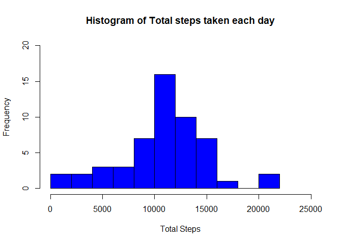
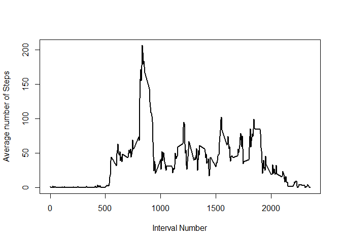
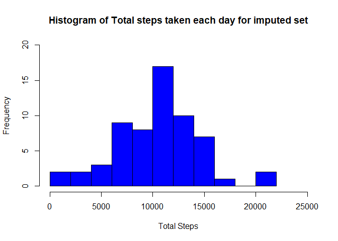
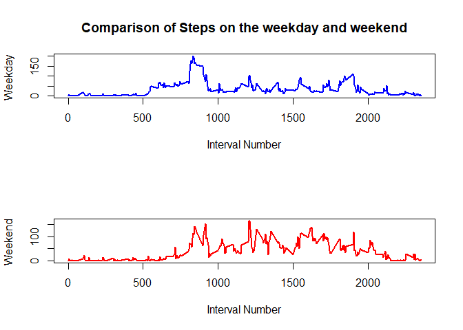

# PA1_template
Raj Purkayastha  
5 May 2017  


## Loading the data

We will start the analysis by loading the data via read.csv. At this point I will not be modifying the data 


```r
myactivity<-read.csv('activity.csv')
```
##Determining the mean total number of steps taken per day

We will first remove al the NA's present in this data set

```r
mycleanactivity<-myactivity[complete.cases(myactivity),]
```
After this we can use the aggregate function on the new data frame to calculate the total number of steps taken per day


```r
dailysteps<-aggregate(mycleanactivity$steps,FUN=sum,by=list(mycleanactivity$date))
colnames(dailysteps)<-c('Date','Total Steps')
```

The results can be plotted as a histogram using the following code


```r
hist(dailysteps$`Total Steps`,main='Histogram of Total steps taken each day',xlab='Total Steps',col='blue',xlim=c(0,25000),ylim=c(0,20),breaks=10)
```

<!-- -->

The mean and median are calculated as follows


```r
dailystepsmean<- mean(dailysteps$`Total Steps`)
dailystepsmedian<-median(dailysteps$`Total Steps`)
```

The mean of daily steps taken is 1.0766189\times 10^{4} and the median value is 10765 .

##Determining the average daily activity pattern

to determine this we will plot a time series plot of the average number of steps taken for each interval across all the days


```r
intervalsteps<-aggregate(mycleanactivity$steps,FUN=mean,by=list(mycleanactivity$interval))
colnames(intervalsteps)<-c('Interval','Average Steps')

plot(intervalsteps$Interval,intervalsteps$`Average Steps`,type='l',xlab='Interval Number',ylab='Average number of Steps',lwd=2)
```

<!-- -->

The interval which contains the maximum nuber of steps is determined the following way


```r
maxintervalsteps<-max(intervalsteps$`Average Steps`)
locmaxintervalsteps<-which.max(intervalsteps$`Average Steps`)
maxintervalsteps_val<-intervalsteps$Interval[locmaxintervalsteps]
```

The interval number 835 has a maximum number of steps which is 206.1698113. 

##Imputing missing values

The number of missing values is calculated as follows


```r
logicals<-is.na(myactivity$steps)
totalna<-sum(logicals)
```

The number of missing values is 2304.

To impute missing values we use the Mice library. Using the mice function we perform the following procedure


```r
 library(mice)
tempdata<-mice(myactivity,m=5,maxit=50,meth='pmm',seed=500)
```

```
## 
##  iter imp variable
##   1   1  steps
##   1   2  steps
##   1   3  steps
##   1   4  steps
##   1   5  steps
##   2   1  steps
##   2   2  steps
##   2   3  steps
##   2   4  steps
##   2   5  steps
##   3   1  steps
##   3   2  steps
##   3   3  steps
##   3   4  steps
##   3   5  steps
##   4   1  steps
##   4   2  steps
##   4   3  steps
##   4   4  steps
##   4   5  steps
##   5   1  steps
##   5   2  steps
##   5   3  steps
##   5   4  steps
##   5   5  steps
##   6   1  steps
##   6   2  steps
##   6   3  steps
##   6   4  steps
##   6   5  steps
##   7   1  steps
##   7   2  steps
##   7   3  steps
##   7   4  steps
##   7   5  steps
##   8   1  steps
##   8   2  steps
##   8   3  steps
##   8   4  steps
##   8   5  steps
##   9   1  steps
##   9   2  steps
##   9   3  steps
##   9   4  steps
##   9   5  steps
##   10   1  steps
##   10   2  steps
##   10   3  steps
##   10   4  steps
##   10   5  steps
##   11   1  steps
##   11   2  steps
##   11   3  steps
##   11   4  steps
##   11   5  steps
##   12   1  steps
##   12   2  steps
##   12   3  steps
##   12   4  steps
##   12   5  steps
##   13   1  steps
##   13   2  steps
##   13   3  steps
##   13   4  steps
##   13   5  steps
##   14   1  steps
##   14   2  steps
##   14   3  steps
##   14   4  steps
##   14   5  steps
##   15   1  steps
##   15   2  steps
##   15   3  steps
##   15   4  steps
##   15   5  steps
##   16   1  steps
##   16   2  steps
##   16   3  steps
##   16   4  steps
##   16   5  steps
##   17   1  steps
##   17   2  steps
##   17   3  steps
##   17   4  steps
##   17   5  steps
##   18   1  steps
##   18   2  steps
##   18   3  steps
##   18   4  steps
##   18   5  steps
##   19   1  steps
##   19   2  steps
##   19   3  steps
##   19   4  steps
##   19   5  steps
##   20   1  steps
##   20   2  steps
##   20   3  steps
##   20   4  steps
##   20   5  steps
##   21   1  steps
##   21   2  steps
##   21   3  steps
##   21   4  steps
##   21   5  steps
##   22   1  steps
##   22   2  steps
##   22   3  steps
##   22   4  steps
##   22   5  steps
##   23   1  steps
##   23   2  steps
##   23   3  steps
##   23   4  steps
##   23   5  steps
##   24   1  steps
##   24   2  steps
##   24   3  steps
##   24   4  steps
##   24   5  steps
##   25   1  steps
##   25   2  steps
##   25   3  steps
##   25   4  steps
##   25   5  steps
##   26   1  steps
##   26   2  steps
##   26   3  steps
##   26   4  steps
##   26   5  steps
##   27   1  steps
##   27   2  steps
##   27   3  steps
##   27   4  steps
##   27   5  steps
##   28   1  steps
##   28   2  steps
##   28   3  steps
##   28   4  steps
##   28   5  steps
##   29   1  steps
##   29   2  steps
##   29   3  steps
##   29   4  steps
##   29   5  steps
##   30   1  steps
##   30   2  steps
##   30   3  steps
##   30   4  steps
##   30   5  steps
##   31   1  steps
##   31   2  steps
##   31   3  steps
##   31   4  steps
##   31   5  steps
##   32   1  steps
##   32   2  steps
##   32   3  steps
##   32   4  steps
##   32   5  steps
##   33   1  steps
##   33   2  steps
##   33   3  steps
##   33   4  steps
##   33   5  steps
##   34   1  steps
##   34   2  steps
##   34   3  steps
##   34   4  steps
##   34   5  steps
##   35   1  steps
##   35   2  steps
##   35   3  steps
##   35   4  steps
##   35   5  steps
##   36   1  steps
##   36   2  steps
##   36   3  steps
##   36   4  steps
##   36   5  steps
##   37   1  steps
##   37   2  steps
##   37   3  steps
##   37   4  steps
##   37   5  steps
##   38   1  steps
##   38   2  steps
##   38   3  steps
##   38   4  steps
##   38   5  steps
##   39   1  steps
##   39   2  steps
##   39   3  steps
##   39   4  steps
##   39   5  steps
##   40   1  steps
##   40   2  steps
##   40   3  steps
##   40   4  steps
##   40   5  steps
##   41   1  steps
##   41   2  steps
##   41   3  steps
##   41   4  steps
##   41   5  steps
##   42   1  steps
##   42   2  steps
##   42   3  steps
##   42   4  steps
##   42   5  steps
##   43   1  steps
##   43   2  steps
##   43   3  steps
##   43   4  steps
##   43   5  steps
##   44   1  steps
##   44   2  steps
##   44   3  steps
##   44   4  steps
##   44   5  steps
##   45   1  steps
##   45   2  steps
##   45   3  steps
##   45   4  steps
##   45   5  steps
##   46   1  steps
##   46   2  steps
##   46   3  steps
##   46   4  steps
##   46   5  steps
##   47   1  steps
##   47   2  steps
##   47   3  steps
##   47   4  steps
##   47   5  steps
##   48   1  steps
##   48   2  steps
##   48   3  steps
##   48   4  steps
##   48   5  steps
##   49   1  steps
##   49   2  steps
##   49   3  steps
##   49   4  steps
##   49   5  steps
##   50   1  steps
##   50   2  steps
##   50   3  steps
##   50   4  steps
##   50   5  steps
```

```r
completeactivity<-complete(tempdata,1)
```

m=5 refers to the number of imputed datasets, pmm refers to the method which is predictive Mean matching. 

We then generate a histogram of total number of steps along with mean and median calculations.


```r
ca_dailysteps<-aggregate(completeactivity$steps,FUN=sum,by=list(completeactivity$date))
colnames(ca_dailysteps)<-c('Date','Total Steps')
hist(ca_dailysteps$`Total Steps`,main='Histogram of Total steps taken each day for imputed set',xlab='Total Steps',col='blue',xlim=c(0,25000),ylim=c(0,20),breaks=10)
```

<!-- -->

```r
ca_dailystepsmean<- mean(ca_dailysteps$`Total Steps`)
ca_dailystepsmedian<-median(ca_dailysteps$`Total Steps`)
```
The mean of daily steps taken is 1.0399885\times 10^{4} and the median value is 10439 . These values differ and are lower. This implies that he method used for substitution on the whole, put in lower values than the mean for the NA values. 

##Comparing activity patterns between weekdays and weekends

First we create a new factor variable


```r
library(timeDate)
isweekdaycol<-isWeekday(completeactivity$date)
isweekendcol<-isWeekend(completeactivity$date)
completeactivity$wDay<-factor(isweekdaycol,levels=c(FALSE,TRUE),labels=c('Weekend','weekday'))

ca_weekday<-completeactivity[isweekdaycol,]
ca_weekend<-completeactivity[isweekendcol,]

wkday_intervalsteps<-aggregate(ca_weekday$steps,FUN=mean,by=list(ca_weekday$interval))
colnames(wkday_intervalsteps)<-c('Interval','Average Steps')

wkend_intervalsteps<-aggregate(ca_weekend$steps,FUN=mean,by=list(ca_weekend$interval))
colnames(wkend_intervalsteps)<-c('Interval','Average Steps')
```
We then proceed to create a panel plot with average number of steps taken averaged across all weekdays and weekends.


```r
par(mfrow=c(2,1))
plot(wkday_intervalsteps$Interval,wkday_intervalsteps$`Average Steps`,type='l',main='Comparison of Steps on the weekday and weekend',xlab='Interval Number',ylab='Weekday ',lwd=2,col='blue')

plot(wkend_intervalsteps$Interval,wkend_intervalsteps$`Average Steps`,type='l',xlab='Interval Number',ylab='Weekend ',lwd=2,col='red')
```

<!-- -->
